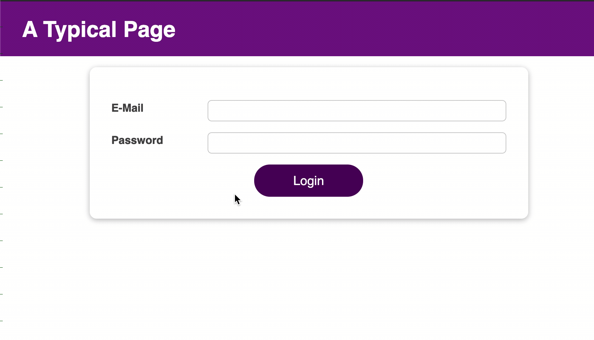

# Login form built with React

## Project overview

This Login form is built with React following [React Complete Guide](https://www.udemy.com/course/react-the-complete-guide-incl-redux/)

Note:

- This project shows only Login UI. The Login form is not integrated with a Database:

## Project outcomes

- I practiced useState() hook;
- Learned useReducer(), useEffect(), useRef();
- Learned about Context API and useContext() hook for passing data through the components tree.
